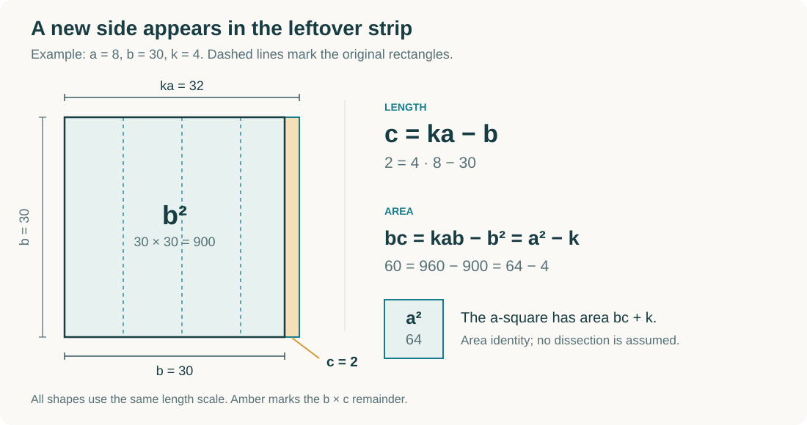
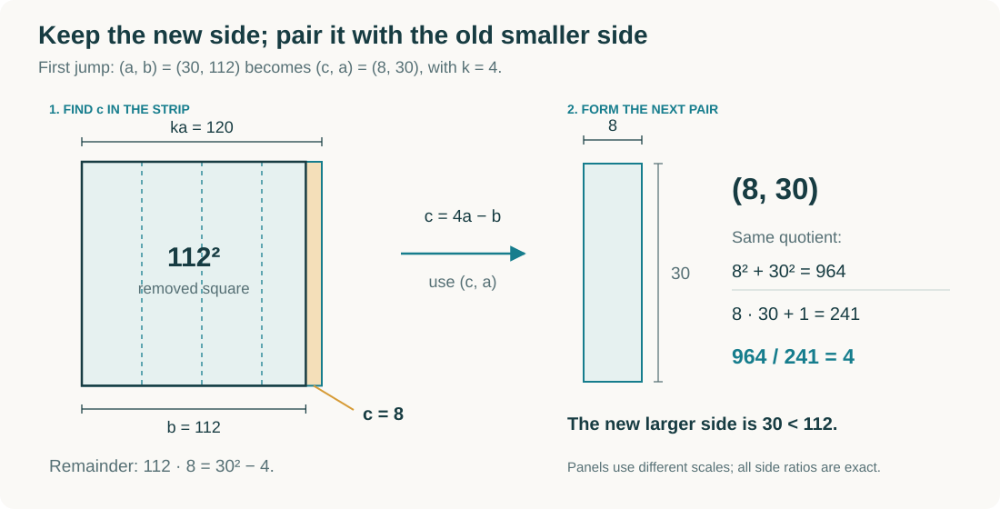
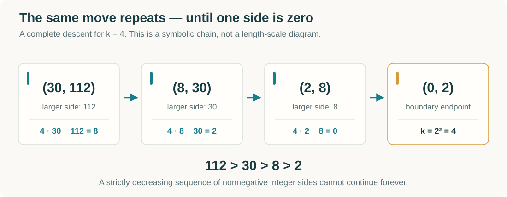
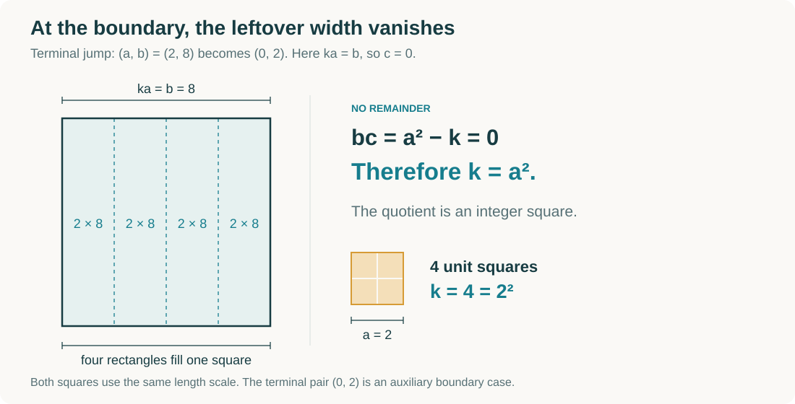

# A geometric interpretation of Vieta jumping

### IMO 1988 · Problem 6

**The jump is a leftover width.** Place copies of a rectangle side by side, remove a square, and repeat with the smaller pair of lengths. The familiar substitution $b\mapsto ka-b$ becomes something you can see.

By **Pranay Manocha** · [Typeset note](proof.pdf) · [LaTeX source](proof.tex)



This is a visual interpretation of the classical Vieta-jumping proof. The complete argument is below, including why the square fits, why the new lengths remain integers, and why the construction must end. [Earlier treatments and related work](#relation-to-vieta-jumping-and-earlier-work) are credited below; no claim of priority is made.

## The problem

Let $a$ and $b$ be positive integers such that $ab+1$ divides $a^2+b^2$. Prove that

$$
k=\frac{a^2+b^2}{ab+1}
$$

is a perfect square.

This is Problem 6 of the [1988 International Mathematical Olympiad](https://www.imo-official.org/assets/documents/problems/1988/1988_eng.pdf), held in Australia.

## 1. Two squares, repeated rectangles

Swap the names if necessary so that $1\le a\le b$. Since the quotient is a positive integer,

$$
a^2+b^2=kab+k.
$$

Read this as an equality of areas:

> An $a$-square and a $b$-square have the same total area as $k$ copies of an $a\times b$ rectangle together with $k$ unit squares.

Place the $k$ rectangles alongside one another, each with width $a$ and height $b$. Their combined width is $ka$. The width left after taking away a $b\times b$ square is

$$
\boxed{c=ka-b.}
$$

First we must justify that the large square actually fits.

### Why the leftover width cannot be negative

Suppose $ka\lt b$. Because the lengths are integers, $b-ka\ge1$. The original equation gives

$$
k=a^2+b(b-ka)\ge a^2+b>b.
$$

But $b\ge ka+1\ge k+1$, since $a\ge1$. These two inequalities contradict each other. Therefore $ka\ge b$, so **$c$ is a nonnegative integer**.

We can now remove the $b$-square from the strip. What remains is a $b\times c$ rectangle, of area

$$
bc=b(ka-b)=kab-b^2=a^2-k.
$$

Equivalently,

$$
\boxed{a^2=bc+k.}
$$

The small square has exactly $k$ more units of area than the leftover rectangle. This is an **area identity**; it does not assert that the long leftover rectangle fits inside the small square without being cut.

## 2. The same construction works again

The strip gives us two relations:

$$
b+c=ka,\qquad bc=a^2-k.
$$

Use them to compare the new squares:

$$
\begin{aligned}
a^2+c^2
&=bc+k+c^2\\
&=c(b+c)+k\\
&=kac+k\\
&=k(ac+1).
\end{aligned}
$$

Thus **the new pair $(c,a)$ satisfies exactly the same equation, with the same $k$**. Geometrically, the $a$-square and the $c$-square have the combined area of $k$ new $c\times a$ rectangles plus the same $k$ units of area.

The new length is strictly smaller:

$$
0\le c=\frac{a^2-k}{b}<\frac{a^2}{b}\le a.
$$

So the replacement

$$
\boxed{(a,b)\longmapsto(ka-b,a)=(c,a)}
$$

preserves the equation and decreases the sum of the lengths: $c+a\lt a+b$. If $c>0$, the new pair is again ordered, positive, and integral. We can repeat every step of the argument.



## 3. Descent leaves a square

A strictly decreasing sequence of positive integer sums cannot continue forever. Every pair with two positive lengths admits the next move, so eventually a move produces a zero length. Write that final pair as $(0,x)$, with $x$ a positive integer.

The preserved equation becomes

$$
0^2+x^2=k(0\cdot x+1),
$$

and hence

$$
\boxed{k=x^2.}
$$

At the last construction, the strip and the large square coincide: there is no leftover rectangle. The other square has area $k$. This proves the result. The case $k=1$ is included: $(1,1)\mapsto(0,1)$.

## A complete example: four rectangles at every step

Start with $(a,b)=(30,112)$. Then

$$
\frac{30^2+112^2}{30\cdot112+1}
=\frac{13444}{3361}=4.
$$

The number of rectangles stays fixed while their dimensions decrease:

| Current pair $(a,b)$ | Leftover width $c=4a-b$ | Area identity $a^2=bc+4$ | Next pair |
| :--- | ---: | :--- | :--- |
| $(30,112)$ | $8$ | $900=896+4$ | $(8,30)$ |
| $(8,30)$ | $2$ | $64=60+4$ | $(2,8)$ |
| $(2,8)$ | $0$ | $4=0+4$ | $(0,2)$ |





The geometric pictures use the stated lengths in proportion within each construction. Separate constructions may use different scales so the shrinking shapes remain legible. The chain above is a symbolic diagram.

<details>
<summary>A little more: the terminal side is the original greatest common divisor</summary>

Each move preserves the greatest common divisor:

$$
\gcd(ka-b,a)=\gcd(a,b).
$$

At the endpoint, $\gcd(0,x)=x$. Therefore the same argument proves the stronger identity

$$
k=\gcd(a,b)^2.
$$

This stronger result also appears in Campbell's 1988 treatment cited below.

</details>

## Relation to Vieta jumping and earlier work

Treating the equation as a quadratic in $b$ gives

$$
t^2-kat+(a^2-k)=0.
$$

Its two roots are $b$ and $ka-b$. Exchanging these roots is the classical **Vieta jump**. The rectangle strip gives the second root a geometric meaning: it is the width left when a $b$-square is removed from $k$ adjacent rectangles.

The arithmetic mechanism is therefore the standard descent. Earlier geometric interpretations also exist, notably integer-point paths on a hyperbola. This note develops the repeated-rectangle interpretation suggested by Pranay Manocha; it does not establish that this particular presentation is historically new. The argument is an area-based interpretation with explicit integer and descent reasoning, rather than a claim that a diagram alone proves the theorem.

### References

1. **International Mathematical Olympiad.** [1988 problems, English](https://www.imo-official.org/assets/documents/problems/1988/1988_eng.pdf), Problem 6. The original problem statement.
2. **John Campbell.** [“A Solution to 1988 IMO Question 6”](https://www.wfnmc.org/mc19882campbell.pdf), *Mathematics Competitions* **1**(2), 1988, pp. 29–32. An early descent proof, including the greatest-common-divisor conclusion.
3. **Kyle Wu.** [“Vieta jumping: visualization and intuition”](https://www.parabola.unsw.edu.au/sites/default/files/2024-05/vol60_no1_8.pdf), *Parabola* **60**(1), 2024. Visualizes the descent using lattice points on a hyperbola. The numerical orbit with $k=4$ used here also appears there.
4. **Rutger Moody and contributors.** [“Math Olympiad 1988 problem 6, canonical solution 2 without Vieta jumping”](https://math.stackexchange.com/questions/1906908/math-olympiad-1988-problem-6-canonical-solution-2-without-vieta-jumping), *Mathematics Stack Exchange*, 2016. A related discussion of a remainder-style descent and a separate geometric attempt; cited as discussion, not as a proof on which this note depends.

## Files and rebuilding

The README is the complete visual exposition. [`proof.pdf`](proof.pdf) is the typeset mathematical note, built from [`proof.tex`](proof.tex). The SVGs in [`figures/`](figures/) are the diagram sources; their matching PDF exports are used by LaTeX, so both versions share the same artwork.

To rebuild the diagrams and PDF, install Python 3, [CairoSVG](https://cairosvg.org/), and [Tectonic](https://tectonic-typesetting.github.io/). Then run:

```sh
python3 -m venv .venv
. .venv/bin/activate
python -m pip install -r requirements.txt
make
```

CairoSVG also needs the system Cairo library; see its installation instructions for your platform. On macOS with Homebrew, `brew install cairo` supplies it. If the library is not found, use `make CAIRO_LIB_DIR="$(brew --prefix)/lib"`.

Alternatively, after `make figures`, compile `proof.tex` with a standard LaTeX installation:

```sh
latexmk -pdf proof.tex
```

`make check` independently checks the displayed examples and exhaustively checks all admissible pairs with $1\le a\le b\le400$. These finite checks are a safeguard against transcription errors; the general proof is above.

The material is currently a private draft. See [`LICENSE`](LICENSE) for its present rights status.
